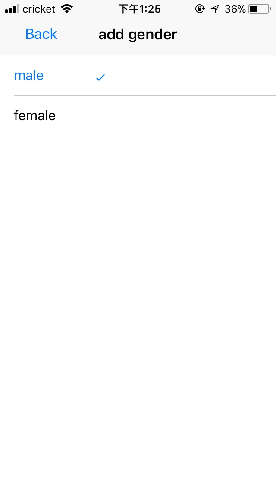

# tinder-react-native
This project was bootstrapped with [Create React Native App](https://github.com/react-community/create-react-native-app).

Uses Firebase and AWS service to store data.

A practice project that simulates tinder app.

### Login Page
* Uses Facebook login to authenticate with firebase.

   

### Profile Page
* Shows basic information of the user, name, avatar, age(optional).

### Update Profile Page
* User can upload photos to the app and delete them.
* User can update About Me, birth year.
* User can select their gender, and choose to show or hide age in their profile page.
* User can change location(states), and filter users in home page by their locations
* User can choose to show or not show notifications of chat messages.

      
   

### Home page
* Tap the left/right part of photo to see previous/next photo of user.

      

* Swipe left or right to see next user. Swiping Left to ignore, swiping right to 'like' a user.

   

   

* If the user you 'like' also liked you, a match is created, and the user will appear in the match page.

   

* Clicking the user in match page to chat with him/her.
 
